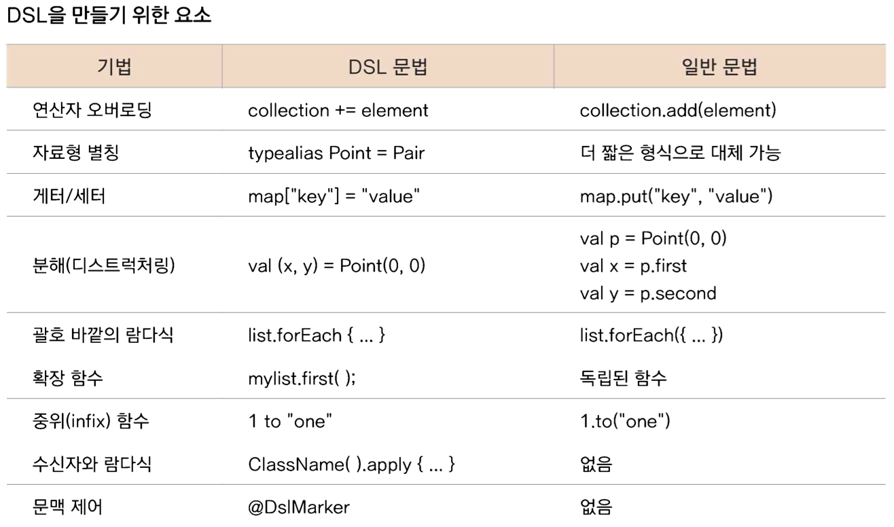

# 10-2 람다식과 DSL

## Domain-Specific Language

- 특정 애플리케이션의 도메인을 위해 특화된 언어
- ex) 데이터베이스만을 다루는 SQL

### 코틀린에서 DSL 사용하기

- DSL 경험해 보기
    
    ```kotlin
    // 먼저 데이터 모델 생성
    data class Person(
            var name: String? = null,
            var age: Int? = null,
            var job: Job? = null)
    
    data class Job(
            var category: String? = null,
            var position: String? = null,
            var extension: Int? = null)
    
    // Version 1 - also
    //fun person(block: (Person) -> Unit): Person {
    //    val p = Person()
    //    block(p)
    //    return p
    //}
    
    // Version 2 - apply
    //fun person(block: Person.() -> Unit): Person {
    //    val p = Person()
    //    p의 block을 객체에 넣어준다.
    //    p.block()
    //    return p
    //}
    
    // Version 3
    fun person(block: Person.() -> Unit): Person = Person().apply(block)
    
    // block을 job에 넣어준다
    fun Person.job(block: Job.() -> Unit) {
        job = Job().apply(block)
    }
    
    fun main() {
        val person = person {
            name = "Kildong"
            age = 40
            job {
                category = "IT"
                position = "Android Developer"
                extension = 1234
            }
        }
    
        println(person)
    }
    ```
    
- DSL을 구현하는 요소
    
    
    

### DSL을 사용한 사례

- Spring 프레임워크
- Ktor 프레임워크
